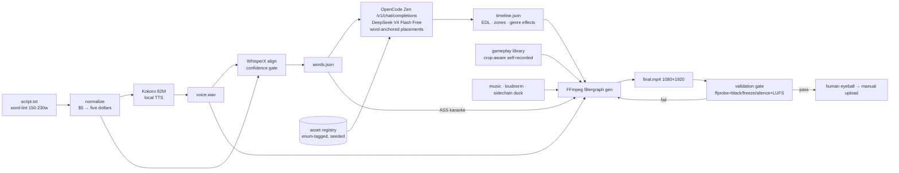

# SlopShots All-in-One — Pipeline Spec

Semi-automated pipeline that turns a text script into a vertical (9:16) narrated
gameplay video for YouTube Shorts / Instagram Reels: local TTS narration,
word-aligned karaoke subtitles, LLM-placed visual overlays, generated FFmpeg
filtergraphs, automated validation, human approval, manual upload (v1).

Status: **pre-benchmark**. No code exists yet. The acceptance gate for the
architecture is the [10-second prototype](14-benchmark-gate.md).

## Pipeline

## Documents

| # | Doc | Stage |
|---|-----|-------|
| 01 | [Script intake](01-script-intake.md) | Text input, normalization, duration lint |
| 02 | [TTS — Kokoro](02-tts-kokoro.md) | Local voice synthesis |
| 03 | [Alignment — WhisperX](03-alignment-whisperx.md) | Word timestamps, confidence gate |
| 04 | [Subtitles](04-subtitles-karaoke.md) | ASS karaoke cards |
| 05 | [Overlay placement](05-overlay-placement.md) | LLM contract, anchoring, collisions |
| 06 | [Asset registry](06-asset-registry.md) | Manifest, taxonomy, ingest |
| 07 | [Timeline / EDL](07-timeline-edl.md) | `timeline.json` schema, zones, effects |
| 08 | [Render — FFmpeg](08-render-ffmpeg.md) | Filtergraph generation, encode |
| 09 | [Audio & music](09-audio-music.md) | Ducking, loudness, fades |
| 10 | [Gameplay library](10-gameplay-library.md) | Capture rules, metadata |
| 11 | [Validation](11-validation.md) | Automated gate + eyeball |
| 12 | [Orchestration & state](12-orchestration-state.md) | Stage-cached artifacts |
| 13 | [Upload](13-upload.md) | Manual v1, API path later |
| 14 | [Benchmark gate](14-benchmark-gate.md) | 10s prototype, acceptance criteria |
| — | [Decisions](decisions.md) | Full decision table with status |
| — | [Risks](risks.md) | Residual risks & mitigations |

## Status legend

- **Decided** — selected and confirmed in an earlier grilling round.
- **Selected (pending re-confirm)** — final-round selection; the session
  transcript does not expose the answer values, so these are treated as
  tentative until the user re-confirms. See [decisions.md](decisions.md).
- **Recommendation** — inferred by the assistant, not yet ratified.
- **Open** — nobody has answered this yet.
